Ali EL ABRIDI

Brandon Crane

Supervisor: Dr. Violetta Cavalli Sforza

CSC 3309 Artificial Intelligence 

Fall 2016 - Al Akhawayn University

Image recognition using Tensor Flow and Google Inception 

**_Video explanatory:_** [https://www.youtube.com/watch?v=aJ7kvZgl1Vs](https://www.youtube.com/watch?v=aJ7kvZgl1Vs)

**_Docker Image with our program: _**[https://drive.google.com/open?id=0B_YOfafxQHLAT2hBcG5oMFhHVkU](https://drive.google.com/open?id=0B_YOfafxQHLAT2hBcG5oMFhHVkU)

**_Github repository:_** [https://github.com/alielabridi/Image-recognition-reCaptcha-TensorFlow](https://github.com/alielabridi/Image-recognition-reCaptcha-TensorFlow)

*Motivation*: We want to build an image recognition program that given a set of 6 images for example and a label X, It will recognize the image that does not correspond to the label X such as in Figure 1. This kind of problem are found in bot detection programs such as Recaptcha. We want this program to be able to learn on the fly if it encountered a category that it does not have in its dataset by crawling data learning set from the internet, specifically Google Images. Thus we use a strong neural network that has already been designed for this called Google Inception used on a Machine learning program called Tensor Flow. The program developed will recognized whether the given label is already in the trained set of the program, if not, It will crawl the internet looking for corresponding pictures of that X label and train our neural network to recognize them, then go through the set of 6 images to tell which one is not X. 

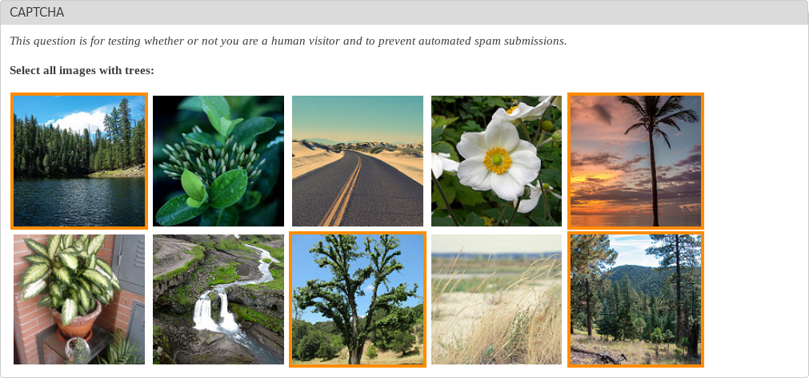

Figure1: Bot detection using a different model of reCaptcha

This is a link to the tutorial we used to allow us to use Google’s Inception v3 neural network.

[https://codelabs.developers.google.com/codelabs/tensorflow-for-poets/index.html?index=..%2F..%2Findex#0](https://codelabs.developers.google.com/codelabs/tensorflow-for-poets/index.html?index=..%2F..%2Findex#0)

We followed the steps but had to make some minor modifications. This documentation will provide all of the steps that we took, listing in **bold** what differs from the codelab tutorial. Quotes will be used to denote verbatim text from the tutorial. 

# A. Installation and Setup

## 1. Introduction

 We were fortunate enough to have the required resources: 

* A basic understanding of Unix commands

* A fast computer running OS X or Linux (Docker can also be installed in Windows)

* A fair amount of time

## 2. Setting Up

We will be using Docker because they "have built a Docker package that contains all the dependencies you need to run TensorFlow, along with the sample code." 

* "[Download the Docker Toolbox](https://www.docker.com/products/docker-toolbox).	

    * **It is important to note that the "Docker Toolbox" is different than just installing “Docker”**

* On the Toolbox page, find the Mac version.

* Download a DockerToolbox-1.xx.xx.pkg file (180MB).

* Run that downloaded pkg to install the Toolbox.

* At the end of the install process, choose the Docker Quickstart Terminal.

* Open a terminal window and follow the installation script.

* If you have already installed Toolbox, just run the Docker Quickstart Terminal in /Applications/Docker/.

* Launch the Docker Quickstart Terminal and run the suggested command in the terminal:

* docker run hello-world

* This should confirm your installation of Docker has worked."

This is what the docker run hello-world command returns.

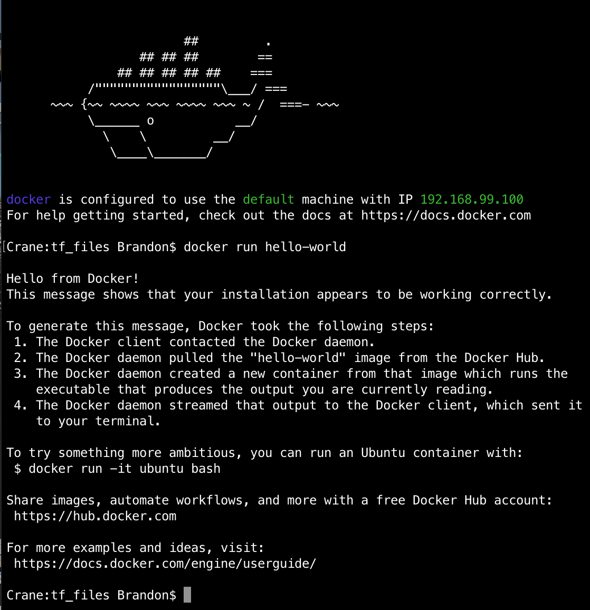

## 3. Installing and Running the TensorFlow Docker Image

Make sure you are still in the Docker Quickstart Terminal. Then run this command: 

docker run -it gcr.io/tensorflow/tensorflow:latest-devel

This command connects you to the TensorFlow Docker Image. Here are the results: 

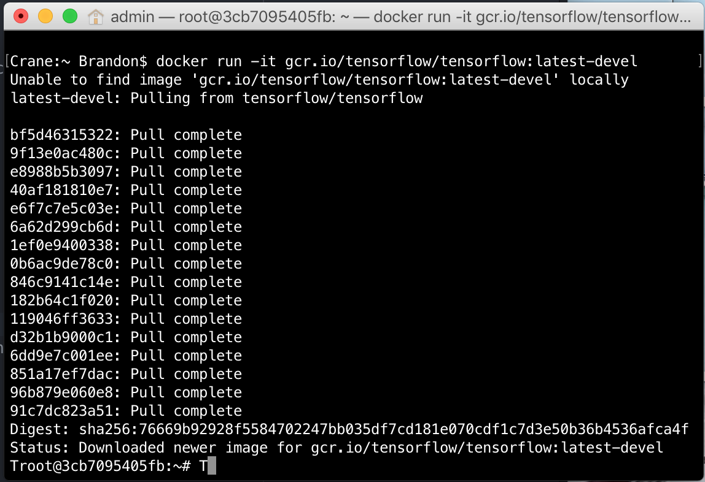

Virtual Box settings were adjusted to the recommendations under the "Running Faster" section.

Then docker run hello-world was run again to verify that the Docker image still worked.

## 4. Retrieving the images

First exit the docker image. Then download this set of sample images. Here are the commands to execute:

% cd $HOME
% mkdir tf_files
% cd tf_files
% curl -O http://download.tensorflow.org/example_images/flower_photos.tgz
% tar xzf flower_photos.tgz

# On OS X, see what's in the folder:
% open flower_photos

At first, we were in a hurry, so we only used two folders of the five provided. **However, we did not remove the folders like the guide suggests. We just put them in another directory, and used them later. **

% cd $HOME/tf_files/flower_photos
% rm -rf dandelion sunflowers tulips

# On OS X, make sure the flowers are gone!
% open .

Then, virtually link this local folder to the docker image. Run this command locally

% docker run -it -v $HOME/tf_files:/tf_files gcr.io/tensorflow/tensorflow:latest-devel

It will then take you to the Docker session, and you should be able to see the directory you just created. With this command: # ls /tf_files/

This is what our execution looked like (Notice the change in directories after the docker run command):

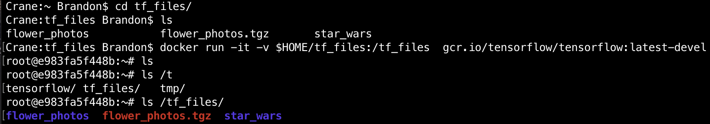

You then must pull the training code from GitHub using (still in Docker session): 

# cd /tensorflow
# git pull

Important: 

"Your sample code will now be in "

/tensorflow/tensorflow/examples/ImagesReadMe/image_retraining/

This is where the files ended up after I pulled:

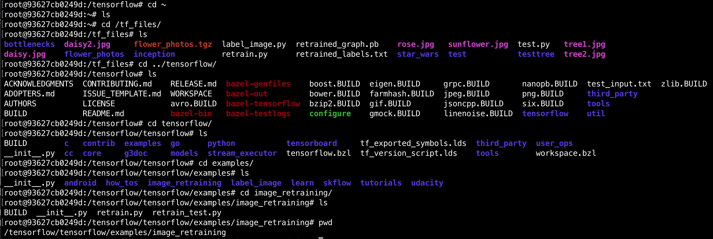

**You will be using ****retrain.py**** so make sure you know where it is. I would recommend finding it before moving on. **

## 5. (Re)training Inception

"At this point, we have a trainer, we have data, so let's train! We will train the Inception v3 network."

Keep in mind that "We're only training the final layer of [this] network." 

**This command takes a lot of arguments, and each one is explained in the tutorial. Before executing, make sure the first directory to ****retrain.py**** is correct, and the ****--ImagesReadMe/image_dir**** is correct. The rest of the directories are used for outputting the results of the training. **

Here is the (modifications in bold) command that is used to retrain the network: 

python **/tensorflow/**tensorflow/examples/ImagesReadMe/image_retraining/retrain.py \

 --bottleneck_dir=/tf_files/bottlenecks \

 --how_many_training_steps 500 \

 --model_dir=/tf_files/inception \

 --output_graph=/tf_files/retrained_graph.pb \

 --output_labels=/tf_files/retrained_labels.txt \

 --ImagesReadMe/image_dir /tf_files/flower_photos

"This script loads the pre-trained Inception v3 model, removes the old final layer, and trains a new one on the flower photos you've downloaded."

These are what some of the steps in the training process look like:

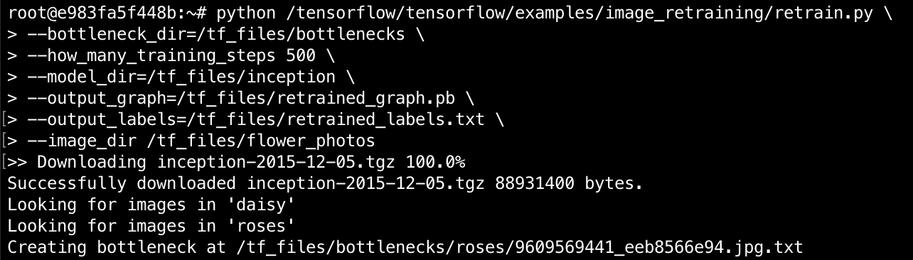

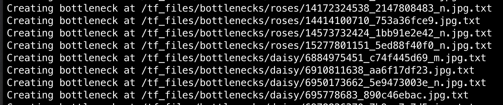

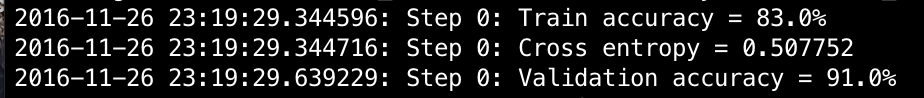

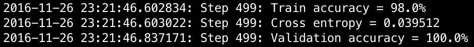

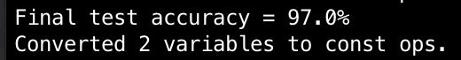

While waiting for the training process to complete, it is recommended to read the next two sections in order to gain a greater understanding of what’s actually happening during training. Some important quotes are included in this documentation.

### While You're Waiting: Bottlenecks

"For this codelab, you are training only the last layer; the previous layers retain their already-trained state."

"A 'Bottleneck,' then, is an informal term we often use for the layer just before the final output layer that actually does the classification."

"Every image is reused multiple times during training. Calculating the layers behind the bottleneck for each image takes a significant amount of time. By caching the outputs of the lower layers on disk, they don't have to be repeatedly recalculated. By default, they're stored in the /tmp/bottleneck directory. If you rerun the script, they'll be reused, so you don't have to wait for this part again."

### While You're Waiting: Training

* "The training accuracy shows the percentage of the images used in the current training batch that were labeled with the correct class.

* Validation accuracy: The validation accuracy is the precision (percentage of correctly-labelled images) on a randomly-selected group of images from a different set.

* Cross entropy is a loss function that gives a glimpse into how well the learning process is progressing. (Lower numbers are better here.)"

"If the training accuracy is high but the validation accuracy remains low, that means the network is overfitting, and the network is memorizing particular features in the training images that don't help it classify images more generally."

**How it works:**

"By default, this script runs 4,000 training steps. Each step chooses 10 images at random from the training set, finds their bottlenecks from the cache, and feeds them into the final layer to get predictions. Those predictions are then compared against the actual labels to update the final layer's weights through a back-propagation process."

"After all the training steps are complete, the script runs a final test accuracy evaluation on a set of images that are kept separate from the training and validation pictures. This test evaluation provides the best estimate of how the trained model will perform on the classification task."

## 6. Using the Retrained Model

"The retraining script will write out a version of the Inception v3 network with a final layer retrained to your categories to /tmp/output_graph.pb and a text file containing the labels to /tmp/output_labels.txt."

We used the python section of this tutorial, not the C++ section. 

Downloaded the label_image.py file, and ran it on a daisy and a rose. 

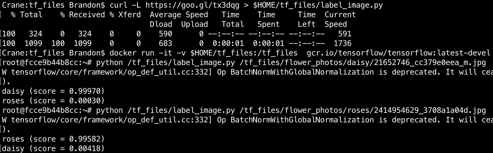

**label_image.py ****will be the basis for our final program.**

(Optional Step 7 not taken)

## 8. Optional Step: Training on Your Own Categories

We now set it up to use our own data, instead of the jpgs provided by Google. The guide states that "In theory, all you have to do is... " but this turned out to be a bit more complex than we initially thought it was going to be. Crawling the Internet for images, will give us all sorts of image extensions, which some have been intentionally corrupted. The purpose of this step is to filter out all the non-jpeg files installed as you cannot limit your crawling to only JPEGs as they are by themselves corrupted. Therefore, the solution that we have came up with is to filter them once downloaded in a very low level described in the implementation of the program in the next section. 

# B. Implementation

The following code ([https://github.com/alielabridi/Image-recognition-reCaptcha-TensorFlow/blob/master/Image-Recognition-ReCaptcha-Fooling.py](https://github.com/alielabridi/Image-recognition-reCaptcha-TensorFlow/blob/master/Image-Recognition-ReCaptcha-Fooling.py)) is executed with python as following: 

python Image-Recognition-ReCaptcha-Fooling.py tree tree1.jpg tree2.jpg tree3.jpg daisy.jpg

```python

# Creator: Ali ELABRIDI and Brandon Crane

# should (pip install icrawler) first 

# pip install icrawler --ignore-installed six

# https://pypi.python.org/pypi/icrawler/0.1.5

# using the TensorFlow Docker(please find a pre-arranged image on Github)

from icrawler.examples import GoogleImageCrawler

import os

import sys

import tensorflow as tf, sys

import subprocess

import commands

#retrieve the first argument as the Label to investigate

label = sys.argv[1]

#set the directory to where to put the crawled picture

#where tensorFlow will retrieve them later

directory = "/tf_files/flower_photos"+ "/" +label

#tensorFlow parse all the folder in the tf_files

#if by any change it finds a folder or a subfolder with a name

#and picture instead of it. It will train on those pictures

#with a label as the name of the folder

#first thing is we chech whether a folder exists with the given

#name so to know whether our Neural Networks are already trained

#on that label if not we make a directory with all crawled picture

#inside of it and start the training process

if not os.path.exists(directory):

	#the label does not exists so we create one

	os.mkdir(directory)

	#crawling from google image on X label

	google_crawler = GoogleImageCrawler(directory)

	google_crawler.crawl(keyword=label, offset=0, max_num=40,

	                     date_min=None, date_max=None, feeder_thr_num=1,

	                     parser_thr_num=1, downloader_thr_num=4,

	                     min_size=(200,200), max_size=None)

	#delete all picture found in the directory that are not JPEG

	#by checking there extention and by running the file command

	#and parse whether there is the world JPEG image data in it

	#to confirm that is not a corrupted JPEG file

	for root, dirs, files in os.walk(directory):

		for currentFile in files:

			ext = '.jpg'

			s = commands.getstatusoutput('file ' + directory + '/' + currentFile)[1]

			if ((s.find('JPEG image data') == -1) or (not currentFile.lower().endswith(ext))):

				os.remove(os.path.join(root,  directory + '/' + currentFile))

	# run tensorFlow trainning program that will go through the new folder in tf_files

	#that contained the pictures crawled and classify them as the name of the folder

	subprocess.call("python /tensorflow/tensorflow/examples/ImagesReadMe/image_retraining/retrain.py \

	--bottleneck_dir=/tf_files/bottlenecks \

	--how_many_training_steps 500 \

	--model_dir=/tf_files/inception \

	--output_graph=/tf_files/retrained_graph.pb \

	--output_labels=/tf_files/retrained_labels.txt \

	--ImagesReadMe/image_dir /tf_files/flower_photos", shell=True)

minIndex = ""

# we start by 2 because it is where the images to be compared are

for x in sys.argv[2:]:

	#print x

	ImagesReadMe/image_path = x

	# Read in the ImagesReadMe/image_data

	ImagesReadMe/image_data = tf.gfile.FastGFile(ImagesReadMe/image_path, 'rb').read()

	# Loads label file, strips off carriage return

	label_lines = [line.rstrip() for line

	                   in tf.gfile.GFile("/tf_files/retrained_labels.txt")]

	# Unpersists graph from file

	with tf.gfile.FastGFile("/tf_files/retrained_graph.pb", 'rb') as f:

	    graph_def = tf.GraphDef()

	    graph_def.ParseFromString(f.read())

	    _ = tf.import_graph_def(graph_def, name='')

	with tf.Session() as sess:

	    # Feed the ImagesReadMe/image_data as input to the graph and get first prediction

	    softmax_tensor = sess.graph.get_tensor_by_name('final_result:0')

	    predictions = sess.run(softmax_tensor, \

	             {'DecodeJpeg/contents:0': ImagesReadMe/image_data})

	    # Sort to show labels of first prediction in order of confidence

	    top_k = predictions[0].argsort()[-len(predictions[0]):][::-1]

	    for node_id in top_k:

	        human_string = label_lines[node_id]

	        score = predictions[0][node_id]

	        print('%s is a %s (score = %.5f)' % (x,human_string, score))

	        #the set first element as the NOT label one

	        if(human_string == label and x == sys.argv[2]):

	        	minIndex = x

	        	minScore = score

	        #look for the one that has the lowest probability of being label

	        if(human_string == label and x!= sys.argv[2] and minScore > score):

	        	minIndex = x

	        	minScore = score

#print the image that has the lowest correspondance with label

#we can also get all images that do not fit the requirement of

#being a label by setting a threshold of probabilities and get that

#are bellow it as being not corresponding to the label

print "The one that is not a "+label+ " is: "+ minIndex

```

# 
C. Google Inception v3 (Convolutional Neural Network)

(most of the content has been retrieved from https://research.googleblog.com/2015/06/inceptionism-going-deeper-into-neural.html)

## 1.What is Google Inception

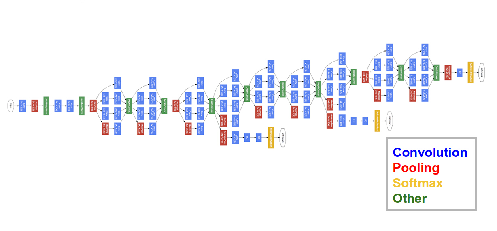

We train an artificial neural network by showing it millions of training examples and gradually adjusting the network parameters until it gives the classifications we want. The network typically consists of 10-30 stacked layers of artificial neurons. Each image is fed into the input layer, which then talks to the next layer, until eventually the "output" layer is reached. The network’s “answer” comes from this final output layer. One of the challenges of neural networks is understanding what exactly goes on at each layer. We know that after training, each layer progressively extracts higher and higher-level features of the image, until the final layer essentially makes a decision on what the image shows. For example, the first layer maybe looks for edges or corners. Intermediate layers interpret the basic features to look for overall shapes or components, like a door or a leaf. The final few layers assemble those into complete interpretations—these neurons activate in response to very complex things such as entire buildings or trees.we train networks by simply showing them many examples of what we want them to learn, hoping they extract the essence of the matter at hand. For Google Inception, instead of exactly prescribing which feature we want the network to amplify, it also lets the network make that decision. In this case we simply feed the network an arbitrary image or photo and let the network analyze the picture. It then picks a layer and ask the network to enhance whatever it detected. Each layer of the network deals with features at a different level of abstraction, so the complexity of features it generates depends on which layer it enhances. For example, lower layers tend to produce strokes or simple ornament-like patterns, because those layers are sensitive to basic features such as edges and their orientations (see figure 2 and 3)

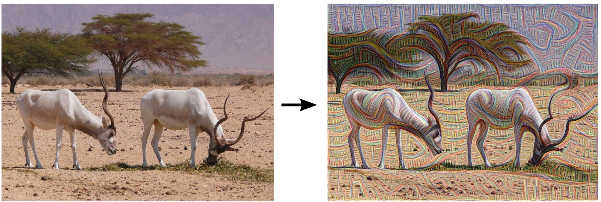.

	Figure 2: image processed by a layer of Google Inception to amplify some features

## 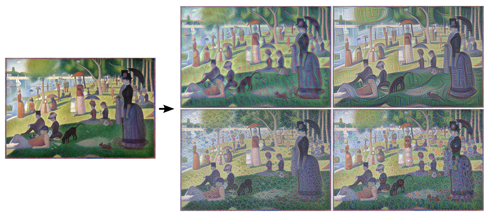

	Figure 3: image processed by a layer of Google Inception to amplify some features

In higher-level layers, which identify more sophisticated features in images, complex features or even whole objects tend to emerge. Again, we just start with an existing image and give it to our neural net. It asks the network: "Whatever you see there, I want more of it!" This creates a feedback loop: if a cloud looks a little bit like a bird, the network will make it look more like a bird. This in turn will make the network recognize the bird even more strongly on the next pass and so forth, until a highly detailed bird appears, seemingly out of nowhere.

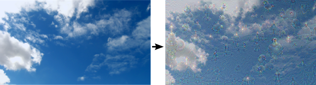

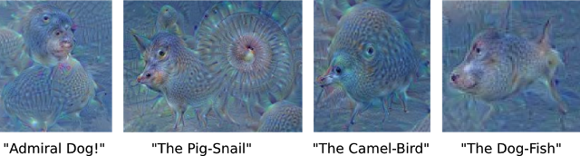

The results are intriguing—even a relatively simple neural network can be used to over-interpret an image, just like as children we enjoyed watching clouds and interpreting the random shapes. This network was trained mostly on images of animals, so naturally it tends to interpret shapes as animals. But because the data is stored at such a high abstraction, the results are an interesting remix of these learned features.

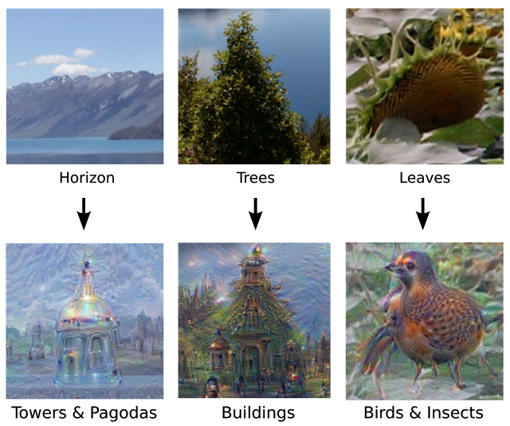

If we apply the algorithm iteratively on its own outputs and apply some zooming after each iteration, we get an endless stream of new impressions, exploring the set of things the network knows about, as seen in the following images:

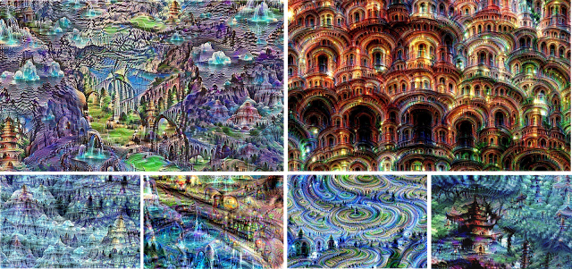

## 2.Why did we choose Google Inception

Google inception uses deep convolutional networks that have been central to the largest advances in image recognition performance in recent years. Moreover, Google inception architecture has shown great performance at relatively low computational cost as it has proven it for classification and detection in the ImageNet Large Scale Visual Recognition Challenge 2016 (ILSVRC), where software programs compete to correctly classify and detect objects and scenes ([http://image-net.org/challenges/LSVRC/2016/results](http://image-net.org/challenges/LSVRC/2016/results)).

# D. TesorFlow

(most of the content has been retrieved from https://www.tensorflow.org/) 

### 1. What is TensorFlow?

TensorFlow is an open source software library for numerical computation using data flow graphs. Nodes in the graph represent mathematical operations, while the graph edges represent the multidimensional data arrays (tensors) communicated between them. The flexible architecture allows you to deploy computation to one or more CPUs or GPUs in a desktop, server, or mobile device with a single API. TensorFlow was originally developed by researchers and engineers working on the Google Brain Team within Google's Machine Intelligence research organization for the purposes of conducting machine learning and deep neural networks research, but the system is general enough to be applicable in a wide variety of other domains as well.

## 2. What is a Data Flow Graph?

Data flow graphs describe mathematical computation with a directed graph of nodes & edges. Nodes typically implement mathematical operations, but can also represent endpoints to feed in data, push out results, or read/write persistent variables. Edges describe the input/output relationships between nodes. These data edges carry dynamically-sized multidimensional data arrays, or tensors. The flow of tensors through the graph is where TensorFlow gets its name. Nodes are assigned to computational devices and execute asynchronously and in parallel once all the tensors on their incoming edges becomes available.

# 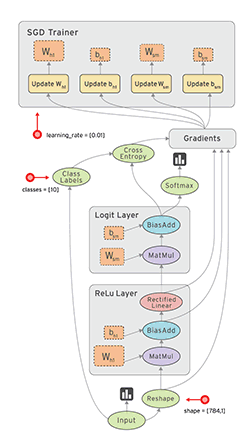

## 3. Why did we choose TensorFlow?

TensorFlow gave us access to the Inception v3 convolutional neural network. This is a very powerful neural network that was needed to complete our task. Creating our own way of classifying images would not come close to the accuracy of Inception v3 (as seen in [this](https://research.googleblog.com/2015/12/how-to-classify-images-with-tensorflow.html) research blog). On top of that, TensorFlow is open source, so if we needed to change anything in the source, we could. It’s purpose is to give "students, researchers, hobbyists, hackers, engineers, developers, inventors and innovators" access to standard tools for machine learning. We used it exactly for this purpose. Another reason to use this product is its portability. Code will run consistently on all different types of machines, so long as the right dependencies are installed. 

## E. Docker 

(quotes from https://www.docker.com/what-docker#/VM)

## 1. What is Docker?

Docker is a technology centered around containers. "Containers include the application and all of its dependencies --but share the kernel with other containers, running as isolated processes in user space on the host operating system. Docker containers are not tied to any specific infrastructure: they run on any computer, on any infrastructure, and in any cloud." This is creates an efficient environment that is easy to develop for and run on any machine.

## 2. Why did we choose Docker?

We used Docker because Google Developers had already created a docker image that had all of the dependencies needed to run TensorFlow. That was a more consistent option than installing all of the dependencies. This also allowed easy access of shared resources (such as hardware and file directories) between the native applications and the container. 

# Reference

Large Scale Visual Recognition Challenge 2016 (ILSVRC2016). (n.d.). Retrieved December 03, 2016, from http://image-net.org/challenges/LSVRC/2016/results 

 @. (2015). Inceptionism: Going Deeper into Neural Networks. Retrieved December 03, 2016, from https://research.googleblog.com/2015/06/inceptionism-going-deeper-into-neural.html 

TensorFlow is an Open Source Software Library for Machine Intelligence. (n.d.). Retrieved December 03, 2016, from [https://www.tensorflow.org/](https://www.tensorflow.org/)

@. (2015, December 07). How to Classify Images with TensorFlow. Retrieved December 03, 2016, from https://research.googleblog.com/2015/12/how-to-classify-images-with-tensorflow.html

(n.d.). Retrieved December 3, 2016, from https://www.docker.com/what-docker#/VM

